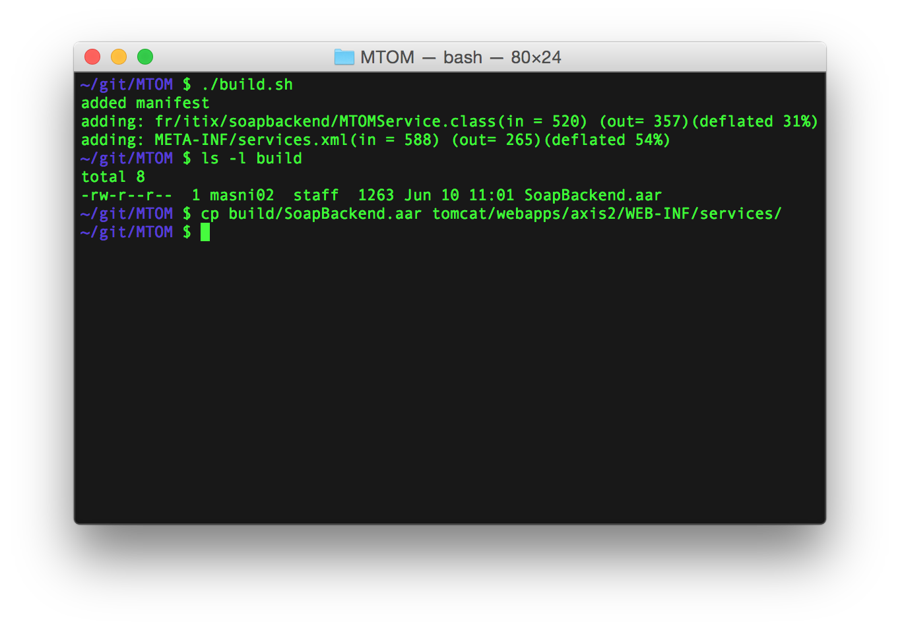
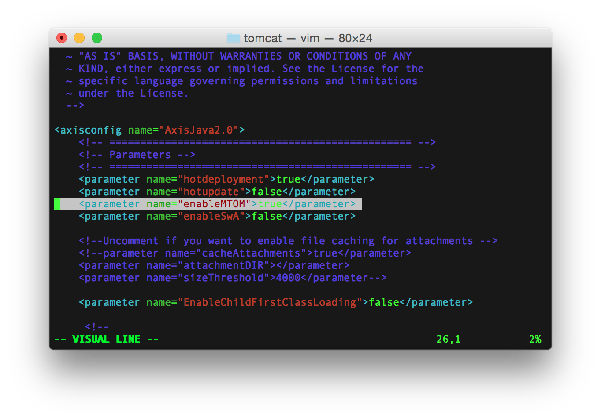
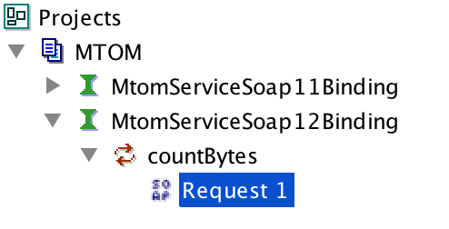
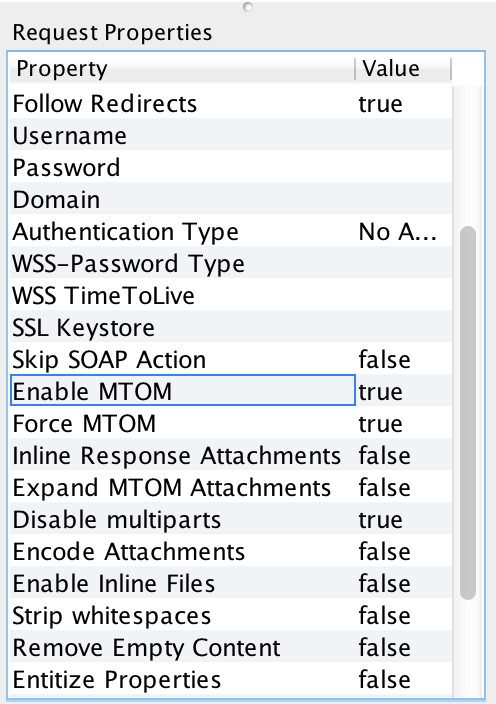
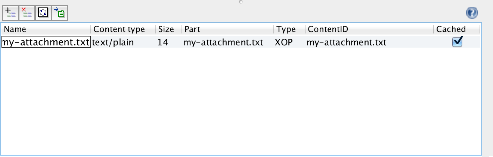
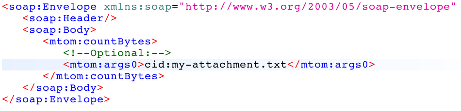
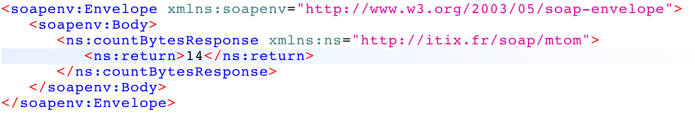

## MTOM Server Code Setup

### Pre-requisites

To make this sample code work, you need: 
 - Tomcat (tested against version 7)
 - Axis2 (tested against version 1.6)

Get tomcat7 and install it in a `tomcat` folder. 
```
$ wget http://www.eu.apache.org/dist/tomcat/tomcat-7/v7.0.62/bin/apache-tomcat-7.0.62.tar.gz && tar zxvf apache-tomcat-*.tar.gz && mv apache-tomcat-*/ tomcat
```

Get axis2 and install the axis2.jar in `tomcat/webapps/axis2`

```
$ cd tomcat/webapps
$ wget http://www.eu.apache.org/dist//axis/axis2/java/core/1.6.2/axis2-1.6.2-war.zip && unzip axis2-1.6.2-war.zip axis2.war
$ cd ..
$ ./bin/startup.sh
```

### Build

Build the .aar archive and deploy it. 



### Change the Axis Configuration to enable MTOM

Edit the Axis2 configuration file: `tomcat/webapps/axis2/WEB-INF/conf/axis2.xml` and set the `enableMTOM` parameter to `true`.



**DO NOT FORGET TO RESTART TOMCAT !!!**

## Test the MTOM attachment

### Retrieve the WSDL

Make sure Tomcat is started and the .aar archive is deployed. Then go to http://localhost:8080/axis2/services/listServices. 

Click on the `MTOMService` to get the WSDL. 

*Note:* make sure you save the file in its original format (File > Save As...). **Do not use copy paste that may break the XML format.**

Just in case, you can find a copy of the WSDL [here](../wsdl/MtomService.wsdl).


### Test in SOAP UI

1. Get SOAP UI (tested with version 5) 
2. Import the WSDL
3. Open the auto-generated request for the `MtomServiceSoap12Binding` binding
   
4. Make sure `Enable MTOM` and `Force MTOM` in the bottom left pane are set to `true`. 
   
5. Import your attachment in the bottom pane. 
   
6. Make sure to reference the attachment in your SOAP message using `cid:attachment-name`. 
   
7. Make sure the attachement part in the bottom pane is set and the attachment type is set to `XOP`
   
8. Fire the request and observe the result ! 
   

Note: by clicking on the raw button in the request pane, you can have a look at the complete HTTP request. 

```
POST http://localhost:8080/axis2/services/MtomService.MtomServiceHttpSoap12Endpoint/ HTTP/1.1
Accept-Encoding: gzip,deflate
Content-Type: multipart/related; type="application/xop+xml"; start="<rootpart@soapui.org>"; start-info="application/soap+xml"; action="urn:countBytes"; boundary="----=_Part_1_223849750.1433937520698"
MIME-Version: 1.0
Content-Length: 912
Host: localhost:8080
Connection: Keep-Alive
User-Agent: Apache-HttpClient/4.1.1 (java 1.5)


------=_Part_1_223849750.1433937520698
Content-Type: application/xop+xml; charset=UTF-8; type="application/soap+xml"; action="countBytes"
Content-Transfer-Encoding: 8bit
Content-ID: <rootpart@soapui.org>

<soap:Envelope xmlns:soap="http://www.w3.org/2003/05/soap-envelope" xmlns:mtom="http://itix.fr/soap/mtom">
   <soap:Header/>
   <soap:Body>
      <mtom:countBytes>
         <!--Optional:-->
         <mtom:args0><inc:Include href="cid:my-attachment.txt" xmlns:inc="http://www.w3.org/2004/08/xop/include"/></mtom:args0>
      </mtom:countBytes>
   </soap:Body>
</soap:Envelope>
------=_Part_1_223849750.1433937520698
Content-Type: text/plain; charset=us-ascii; name=my-attachment.txt
Content-Transfer-Encoding: 7bit
Content-ID: <my-attachment.txt>
Content-Disposition: attachment; name="my-attachment.txt"; filename="my-attachment.txt"

Hello World !

------=_Part_1_223849750.1433937520698--
```

